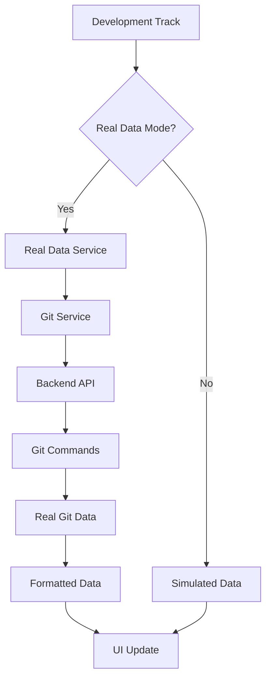

# 🔗 Real Data Integration Guide

This guide explains how to make the Development Track use real data instead of simulated data.

## 🎯 Overview

The Development Track now supports two modes:
- **🎭 Simulated Data**: Template-based data for demonstration
- **📊 Real Data**: Actual git commits, file changes, and project status

## 🚀 Quick Start

### **1. Toggle Real Data Mode**
Click the **"🎭 Simulated Data"** button in the Development Track header to switch to **"📊 Real Data"** mode.

### **2. Backend Setup (Required for Full Real Data)**

#### **Option A: Node.js Backend Service**
```bash
# Create a simple Express server
npm install express cors
```

Create `server.js`:
```javascript
const express = require('express');
const cors = require('cors');
const { handleGitRequest } = require('./src/api/git');

const app = express();
app.use(cors());
app.use(express.json());

app.post('/api/git', handleGitRequest);

app.listen(3001, () => {
  console.log('Git API server running on port 3001');
});
```

#### **Option B: Mock Data (No Backend Required)**
The system will automatically fall back to mock data if the backend is not available.

## 📊 What Real Data Provides

### **📈 App Status Section**
- **Online Status**: Actual deployment status
- **QA Test Results**: Real test outcomes from your CI/CD
- **Release Status**: Actual git status and deployment info
- **What Changed**: Real commit messages and file changes
- **Module Integration**: Actual progress based on real commits

### **📋 Development Status Section**
- **Real Commits**: Actual git commit history with:
  - Real commit hashes
  - Actual author names
  - Real timestamps
  - Actual commit messages
  - File change statistics
- **Task Management**: Integration with project management tools

### **🧪 Testing Results Section**
- **Real Test Results**: Actual test outcomes
- **Performance Metrics**: Real performance data
- **Coverage Reports**: Actual test coverage

## 🔧 Implementation Details

### **Git Service (`src/services/gitService.ts`)**
```typescript
// Fetches real git data
const commits = await gitService.getRecentCommits(10);
const status = await gitService.getRepositoryStatus();
const changes = await gitService.getFileChanges();
```

### **Real Data Service (`src/services/realDataService.ts`)**
```typescript
// Integrates real data with the UI
const appStatus = await realDataService.getRealAppStatus();
const devStatus = await realDataService.getRealDevelopmentStatus();
const testResults = await realDataService.getRealTestResults();
```

### **Backend API (`src/api/git.js`)**
```javascript
// Secure git command execution
app.post('/api/git', handleGitRequest);
```

## 🛡️ Security Considerations

### **Git Command Whitelist**
Only specific git commands are allowed:
- `git log` - Get commit history
- `git status` - Get repository status
- `git branch` - Get branch information
- `git config` - Get configuration
- `git diff` - Get file changes
- `git rev-list` - Get commit counts

### **Command Execution**
- Commands run with 10-second timeout
- Limited to project directory
- Error handling and logging

## 🔄 Data Flow



## 📝 Configuration

### **Environment Variables**
```bash
# .env.local
REACT_APP_USE_REAL_DATA=true
REACT_APP_GIT_API_URL=http://localhost:3001/api/git
```

### **Git Configuration**
```bash
# Ensure git is configured
git config user.name "Your Name"
git config user.email "your.email@example.com"
```

## 🚨 Troubleshooting

### **Common Issues**

#### **1. "Failed to fetch real data"**
- Check if backend server is running
- Verify git repository is accessible
- Check browser console for errors

#### **2. "Git command not allowed"**
- Ensure only whitelisted commands are used
- Check backend security configuration

#### **3. "No commits found"**
- Verify git repository has commits
- Check git log command output

### **Debug Mode**
```typescript
// Enable debug logging
localStorage.setItem('debug', 'true');
```

## 🔮 Future Enhancements

### **Planned Integrations**
- **GitHub API**: Direct GitHub integration
- **CI/CD Integration**: Jenkins, GitHub Actions
- **Project Management**: Jira, Trello, Asana
- **Testing Tools**: Jest, Cypress, Playwright
- **Deployment Status**: Netlify, Vercel, AWS

### **Advanced Features**
- **Real-time Updates**: WebSocket connections
- **Historical Analysis**: Commit trend analysis
- **Performance Metrics**: Bundle size, load times
- **Security Scanning**: Vulnerability reports

## 📚 API Reference

### **Git Service Methods**
```typescript
// Get recent commits
gitService.getRecentCommits(limit: number): Promise<GitCommit[]>

// Get repository status
gitService.getRepositoryStatus(): Promise<GitStatus>

// Get repository info
gitService.getRepositoryInfo(): Promise<RepositoryInfo>

// Get file changes
gitService.getFileChanges(): Promise<FileChange[]>
```

### **Real Data Service Methods**
```typescript
// Get real app status
realDataService.getRealAppStatus(): Promise<RealAppStatus>

// Get real development status
realDataService.getRealDevelopmentStatus(): Promise<RealDevelopmentStatus>

// Get real test results
realDataService.getRealTestResults(): Promise<RealTestResult[]>
```

## 🎉 Benefits of Real Data

### **For Development Teams**
- **Accurate Progress Tracking**: Real commit data
- **Actual Performance Metrics**: Real test results
- **True Project Status**: Current state of development
- **Historical Analysis**: Track progress over time

### **For Project Managers**
- **Real-time Insights**: Current development status
- **Accurate Reporting**: Based on actual data
- **Progress Validation**: Verify claimed progress
- **Resource Planning**: Based on real metrics

### **For Stakeholders**
- **Transparency**: See actual development progress
- **Accountability**: Real data prevents over-reporting
- **Confidence**: Trust in accurate information
- **Decision Making**: Based on real metrics

---

**Ready to use real data?** Toggle the **"🎭 Simulated Data"** button to **"📊 Real Data"** and start seeing your actual development progress!
